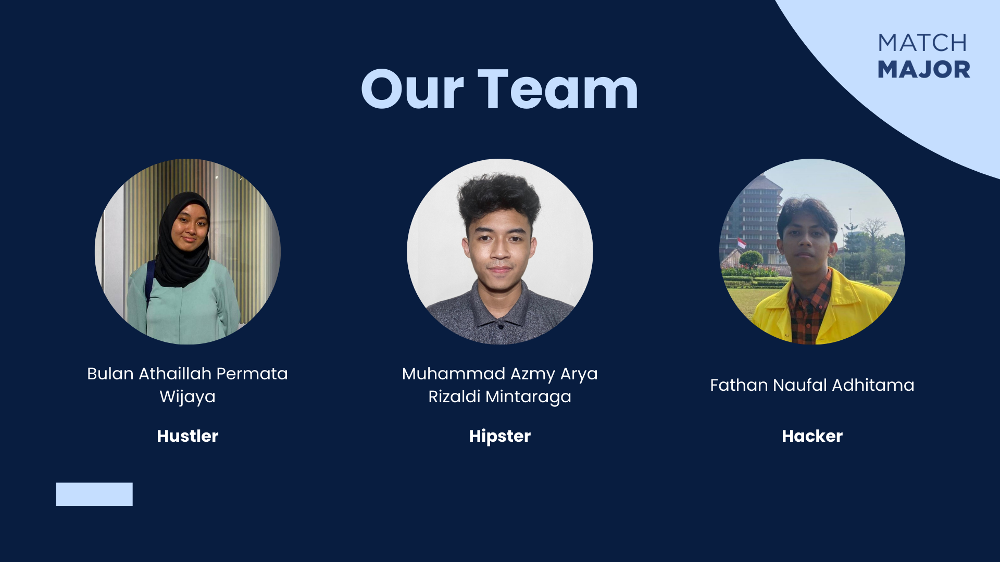

# MatchMajor

**MatchMajor** adalah aplikasi edukasi kreatif yang membantu calon mahasiswa memilih jurusan yang tepat. Aplikasi ini menghubungkan pelajar yang ingin mencari tahu tentang jurusan dengan mahasiswa yang bersedia berbagi pengalaman mereka di jurusan tersebut.

---

## Team: Visdes Core

### Members:

- [Bulan Athaillah Permata Wijaya](https://github.com/bulanath)
- [Fathan Naufal Adhitama](https://github.com/fathanadhitama)
- [Muhammad Azmy Arya Rizaldi Mintaraga](https://github.com/azmyar)

---

## Table of Contents

- [MatchMajor](#matchmajor)
  - [Table of Contents](#table-of-contents)
  - [Team](#team-visdes-core)
  - [Introduction](#introduction)
  - [Features](#features)
  - [Contributing](#contributing)
  - [Usage](#usage)
  - [Contact](#contact)

---

## Introduction

1. **87% mahasiswa** di Indonesia merasa **salah mengambil jurusan**.
2. **80 persen mahasiswa** tidak bekerja sesuai dengan jurusan kuliah setelah mereka lulus.  
   Salah satu alasan utama yang menyebabkan terjadinya fenomena ini adalah karena kurangnya informasi yang valid mengenai jurusan-jurusan yang ada. Oleh karena itu, edukasi mengenai jurusan-jurusan menjadi sangat penting untuk memaksimalkan potensi masyarakat di umur produktif dan mendorong kualitas pendidikan masyarakat sesuai dengan salah satu poin pada **_Sustainable Development Goals (SDGs)_** yaitu **_Quality Education_**.

## Features

Berikut adalah fitur-fitur unggulan yang terdapat dalam aplikasi MatchMajor

- **Matching** : MatchMajor membantu pelajar dengan implementasi algoritma pencocokan untuk membantu mempertemukan para pelajar dengan mahasiswa yang berkuliah di jurusan impiannya
- **Chat** : Fitur diskusi 1-on-1 untuk memberikan kesempatan pelajar berkonsultasi lebih dalam dengan mahasiswa
- **QnA Forum** : Pada halaman profil mahasiswa, terdapat forum tanya jawab terbuka bagi pelajar untuk bertanya secara anonim.

## Contact

Untuk pertanyaan dan informasi lebih lanjut, mohon hubungi anggota [Tim Visdes Core](#team-visdes-core).
